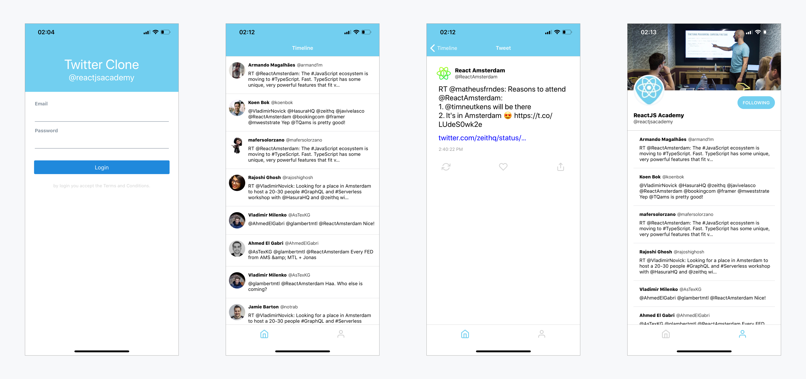

# Twitter Clone Native

> Learn React Native with [reactgraphql.academy](https://reactgraphql.academy/react/training/workshops/react-native/) in a fun way by building a Twitter clone.



## Prerequisites

## Setup

## Running the app

To get the app up and running (and really see if it worked), run:

```console
cd twitter-clone-native
yarn start # you can open iOS, Android, or web from here, or run them directly with the commands below.
yarn android
yarn ios
yarn web
```

This should start up your browser. If you're familiar, this is a standard expo application.

### Exercices
