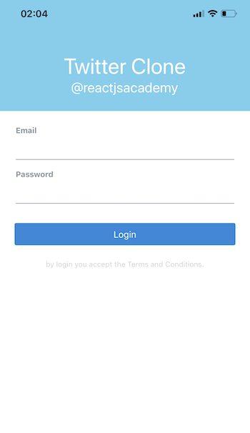

# React Native Foundations

## Learning objectives

- Use a real device to feel the "React Native way of working"™️
- Discover the React Native primitives
- Using a component library

## 🥑 Before we start the exercise

- You should have an `https://expo.io` account
- Download the expo application on your phone
- `react-native-paper` is already included by default in Snack.

## 🤸‍♀️ Exercise 1

We are going to start by creating the Login screen.



[You can download a bigger image for the Login screen here](./login.PNG)

- [ ] Go to [Expo Snack](https://snack.expo.io) and create the Screen from Scratch
- [ ] Use the `TextInput` component
- [ ] Use the `Button` component

### 🏋️‍♀️ Bonus

- [ ] Create your custom `TextInput` and `Button` component

## 🤸‍♀️ Exercise 2

```
  git clone https://github.com/reactjsacademy/react-native-training.git
  git checkout foundation
  cd react-native-training
  npm install
```

- [ ] 1. Paste your LoginScreen from the part 1 Snack into `src/Screens/LoginScreen.js`
- [ ] 2. Change the root component of the application from LoginScreen to TOCScreen. To do this change the default export in `App.js`.
- [ ] 3. There is a bug in `src/Screens/TOCScreen.js`, it can't display all the content. You need to change the View so it has scroll.
- [ ] 4. Nice! we've got our first view with a scroll. Next it's going to use a more performant scroll for long lists. First, change the root component of the application from `TOCScreen` to `TimelineScreens`.
- [ ] 5. Go to `src/Screens/TimelineScreens` and implement a FlatList for the data that is fetched. There are some comments with hints.

If you need some help, raise your hand :)

### 🏋️‍♀️ Bonus

You can use the following icons [https://docs.expo.io/guides/icons/](https://docs.expo.io/guides/icons/)

- [ ] Add likes and retweets to each tweet in the `FlatList`.
