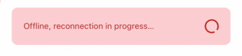

# React Native Data Management

## Learning objectives

- Create an offline experience
- Create an offline experience

## 🥑 Before we start the exercise

- `react-query` is a server-state library but it doesn't you can't use `useState` for something else

## 🤸‍♀️ Exercise 1 Add offline feedback

- [ ] install the library with `yarn add react-native-offline`
- [ ] Add `import { NetworkProvider } from 'react-native-offline';`
- [ ] Add a message when the user is not connected

## 🤸‍♀️ Exercise 2 Fetch data
