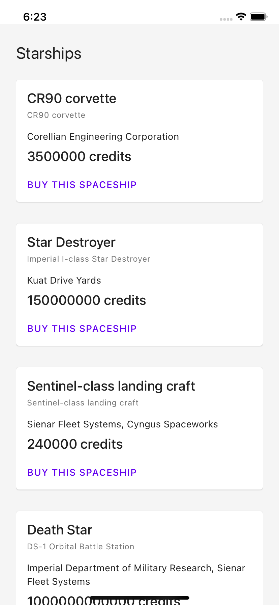

# React Native Data Management

## Learning objectives

- Create an offline experience
- Query and siplay datas from the Star Wars API

## 🥑 Before we start the exercise

- Have a look at the [`react-query` api reference](https://react-query.tanstack.com/docs/api)

## 🤸‍♀️ Exercise 1 Add offline feedback

- [ ] Update `App.tsx`
- [ ] Go to `src/exercice/05/AppShell.tsx`
- [ ] install the library with `yarn add react-native-offline`
- [ ] Add `import { NetworkProvider } from 'react-native-offline';`
- [ ] Add a message when the user is not connected

## 🤸‍♀️ Exercise 2 Fetch data

- [ ] add `react-query`
- [ ] Have a look at [the SWAPI documentation](https://swapi.dev/documentation#starships)
- [ ] Use `fetchAsync('https://swapi.dev/api/starships/')` to query datas (import it from `/src/fetch.ts`)
- [ ] Use the `StarShipCard` to display the datas

## Bonus

- [ ] Add a modal to display all the datas about the spaceship https://callstack.github.io/react-native-paper/modal.html

## 🏅 Elaboration and Feedback

After one exercice, if you want to remember what you've just learned, then 
<a rel="noopener noreferrer" target="_blank" href="https://airtable.com/shrBuZqOJL5UeLLF1?prefill_Name=React+Native+Data+Management&prefill_Exercice=5">
  fill out the elaboration and feedback form.
</a>

